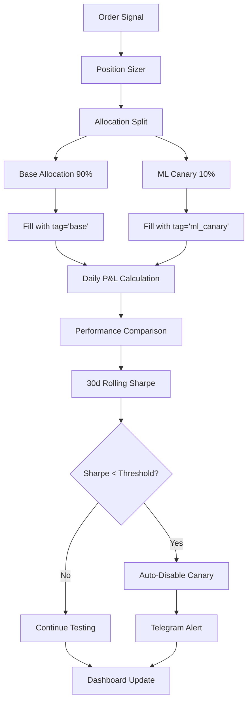
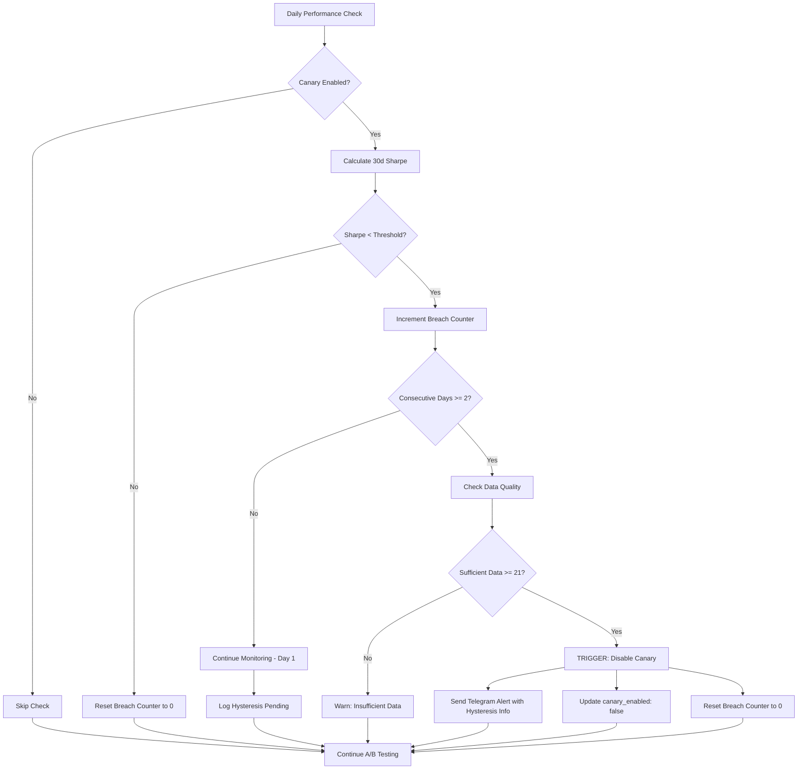

# Canary A/B Testing System

**A comprehensive guide to the Mech-Exo canary allocation system for A/B testing ML strategies**

---

## 📋 Table of Contents

1. [Concept & Flow](#concept--flow)
2. [Database Schema](#database-schema)
3. [Performance Metrics](#performance-metrics)
4. [Auto-Disable Logic](#auto-disable-logic)
5. [Configuration](#configuration)
6. [Operations Guide](#operations-guide)
7. [Dashboard](#dashboard)
8. [FAQ & Troubleshooting](#faq--troubleshooting)

---

## 🎯 Concept & Flow

The canary system implements A/B testing by splitting order allocation between a **base strategy** (90%) and an **ML canary** (10%). This allows safe evaluation of ML enhancements while maintaining capital protection.

### System Flow



### Key Benefits

- **Risk Management**: Limited 10% allocation caps exposure to poor ML performance
- **Continuous Evaluation**: Daily tracking of relative performance metrics
- **Automated Protection**: Auto-disable when underperforming for 30+ days
- **Real-time Monitoring**: Dashboard and alerts for immediate feedback
- **Statistical Rigor**: Sharpe ratio comparison with sufficient observation window

---

## 🗄️ Database Schema

### `canary_performance` Table

**Primary storage for daily A/B performance metrics**

| Column | Type | Description |
|--------|------|-------------|
| `date` | `DATE` | Trading date (PRIMARY KEY) |
| `canary_pnl` | `DOUBLE` | Daily P&L for canary allocation |
| `canary_nav` | `DOUBLE` | Net Asset Value for canary |
| `base_pnl` | `DOUBLE` | Daily P&L for base allocation |
| `base_nav` | `DOUBLE` | Net Asset Value for base |
| `canary_sharpe_30d` | `DOUBLE` | 30-day rolling Sharpe ratio (canary) |
| `base_sharpe_30d` | `DOUBLE` | 30-day rolling Sharpe ratio (base) |
| `sharpe_diff` | `DOUBLE` | Canary Sharpe - Base Sharpe |
| `canary_enabled` | `BOOLEAN` | Whether canary is currently active |
| `days_in_window` | `INTEGER` | Number of observations in Sharpe window |
| `updated_at` | `TIMESTAMP` | Last update timestamp |

**Example Query:**
```sql
SELECT 
    date,
    canary_sharpe_30d,
    base_sharpe_30d,
    sharpe_diff,
    canary_enabled
FROM canary_performance 
WHERE date >= CURRENT_DATE - INTERVAL '30 days'
ORDER BY date DESC;
```

### `fills` Table Enhancement

**Added `tag` column for allocation tracking**

| Column | Type | Description |
|--------|------|-------------|
| `tag` | `VARCHAR(50)` | Allocation identifier: `'base'` or `'ml_canary'` |

**Tag Distribution Query:**
```sql
SELECT 
    tag,
    COUNT(*) as fill_count,
    SUM(ABS(gross_value)) as total_notional,
    AVG(price) as avg_price
FROM fills 
WHERE DATE(filled_at) = CURRENT_DATE
GROUP BY tag;
```

---

## 📊 Performance Metrics

### Sharpe Ratio Formula

**Annualized Sharpe ratio calculation:**

```
Daily Return = Daily P&L / Previous Day NAV
Mean Daily Return = SUM(Daily Returns) / Number of Days
Daily Volatility = STDEV(Daily Returns)
Sharpe Ratio = (Mean Daily Return / Daily Volatility) × √252
```

**Implementation:**
```python
daily_returns = pnl_df['daily_pnl'] / pnl_df['nav'].shift(1)
mean_return = daily_returns.mean()
std_return = daily_returns.std()
sharpe_ratio = (mean_return / std_return) * (252 ** 0.5)
```

### Information Ratio (IR)

**Tracking error-adjusted outperformance:**

```
Excess Returns = Canary Returns - Base Returns
IR = Mean(Excess Returns) / STDEV(Excess Returns) × √252
```

### Maximum Drawdown

**Peak-to-trough decline:**

```
Running Peak = MAX(NAV from inception to current date)
Drawdown = (Current NAV - Running Peak) / Running Peak
Max Drawdown = MIN(All Drawdowns)
```

---

## 🤖 Auto-Disable Logic

### Trigger Conditions

The canary is automatically disabled when **ALL** conditions are met:

1. **Performance Threshold**: `canary_sharpe_30d < disable_threshold_sharpe` (default: 0.0)
2. **Data Quality**: Sufficient observations (`>= 21 days` with `good` or `fair` quality)
3. **Consecutive Breaches**: 2 consecutive days below threshold (hysteresis protection)

### Decision Flow



### Configuration

**`config/allocation.yml`:**
```yaml
# Auto-disable thresholds
disable_rule:
  sharpe_low: 0.0          # Disable if Sharpe < 0 (underperforming risk-free rate)
  confirm_days: 2          # Require 2 consecutive bad days
  max_dd_pct: 2.0         # Alternative: disable if Max DD > 2%
  min_observations: 21     # Minimum days of data required
```

---

## ⚙️ Configuration

### Primary Config: `config/allocation.yml`

```yaml
# Canary A/B Testing Configuration

# Basic allocation settings
canary_enabled: true              # Master enable/disable flag
canary_allocation: 0.10          # 10% of each order to canary

# Auto-disable protection
disable_rule:
  sharpe_low: 0.0               # Threshold for underperformance
  confirm_days: 2               # Consecutive days required
  max_dd_pct: 2.0              # Max drawdown threshold (%)
  min_observations: 21          # Minimum data points required

# Alert configuration
alert_channels:
  - telegram
  - slack

# Metadata
created_at: "2025-01-11T00:00:00Z"
version: "1.0"
```

### Alert Config: `config/alerts.yml`

```yaml
# Telegram configuration for auto-disable alerts
telegram:
  enabled: true
  bot_token: ${TELEGRAM_BOT_TOKEN}
  chat_id: ${TELEGRAM_CHAT_ID}
  username: "Mech-Exo Bot"
```

### Environment Variables

```bash
# Required for Telegram alerts
export TELEGRAM_BOT_TOKEN="your_bot_token_from_botfather"
export TELEGRAM_CHAT_ID="your_chat_id_from_userinfobot"

# Optional: Dry-run mode for testing
export TELEGRAM_DRY_RUN="true"
```

---

## 🛠️ Operations Guide

### How to Re-enable Canary

**Method 1: Configuration File**
```bash
# Edit allocation.yml
vim config/allocation.yml

# Change canary_enabled to true
canary_enabled: true

# Restart any running processes to pick up changes
```

**Method 2: Python API**
```python
from mech_exo.execution.allocation import update_canary_enabled

# Re-enable canary
success = update_canary_enabled(True)
print(f"Canary enabled: {success}")
```

**Method 3: CLI Helper** *(Coming Soon)*
```bash
# Enable canary with 5% allocation
exo canary-enable --pct 0.05

# Disable canary
exo canary-disable

# Check current status
exo canary-status
```

### How to Adjust Allocation Percentage

```yaml
# In config/allocation.yml
canary_allocation: 0.05  # Change from 10% to 5%
```

**Safe allocation ranges:**
- **Conservative**: 2-5% (minimal risk, longer validation time)
- **Standard**: 5-15% (balanced risk/reward)
- **Aggressive**: 15-25% (faster validation, higher risk)

> ⚠️ **Warning**: Never exceed 30% allocation without extensive backtesting

### Manual Monitoring Commands

**Check current status:**
```python
from mech_exo.execution.allocation import is_canary_enabled, get_canary_allocation

print(f"Enabled: {is_canary_enabled()}")
print(f"Allocation: {get_canary_allocation():.1%}")
```

**View recent performance:**
```python
from mech_exo.reporting.query import get_ab_test_summary

summary = get_ab_test_summary(days=30)
print(f"Status: {summary['status_badge']}")
print(f"Sharpe Diff: {summary['sharpe_diff']:+.3f}")
```

**Check health endpoint:**
```bash
curl -H "Accept: application/json" http://localhost:8050/healthz | jq '{canary_sharpe_30d, canary_enabled}'
```

---

## 📊 Dashboard

### A/B Test Tab Features

The **🧪 A/B Test** tab provides comprehensive canary monitoring:

#### **Equity Curves Chart**
- **Blue line**: Base allocation NAV progression
- **Orange line**: Canary allocation NAV progression  
- **Horizontal line**: Starting NAV baseline
- **Interactive**: Hover for exact values and dates

#### **Sharpe Difference Chart**
- **Green bars**: Days when canary outperformed (Sharpe > 0)
- **Red bars**: Days when canary underperformed (Sharpe < 0)
- **Zero line**: Neutral performance baseline

#### **Status Badge**
| Badge | Color | Meaning |
|-------|-------|---------|
| `OFF` | Grey | Canary disabled (manually or auto-disable) |
| `ON (Warming Up)` | Yellow | < 30 days of data, insufficient for Sharpe |
| `ON (Outperforming)` | Green | Sharpe diff > +0.1 |
| `ON (Neutral)` | Blue | Sharpe diff between -0.1 and +0.1 |
| `ON (Underperforming)` | Red | Sharpe diff < -0.1 |

#### **Metrics Cards**
- **Canary**: Current NAV, Total P&L, 30d Sharpe
- **Base**: Current NAV, Total P&L, 30d Sharpe  
- **Comparison**: Sharpe difference, P&L difference, outperformance status

#### **Recent Data Table**
Last 10 trading days with daily NAV, P&L, and Sharpe metrics

### Auto-refresh

Dashboard updates every **24 hours** automatically via `dcc.Interval` component.

---

## ❓ FAQ & Troubleshooting

### Frequently Asked Questions

**Q: Why is the canary allocation limited to 10%?**
A: This provides sufficient statistical power for performance measurement while limiting downside risk. 10% generates enough fills for reliable Sharpe ratio calculation without exposing significant capital to unproven strategies.

**Q: How long before auto-disable triggers?**
A: Minimum 30 days of data (21 actual trading days) with 2 consecutive days below threshold. This prevents false positives from short-term volatility.

**Q: Can I manually override auto-disable?**
A: Yes, edit `config/allocation.yml` and set `canary_enabled: true`. The system will resume A/B testing immediately.

**Q: What happens to pending orders when canary is disabled?**
A: Existing fills are preserved for historical analysis. New orders route 100% to base allocation until canary is re-enabled.

**Q: Why use Sharpe ratio instead of just returns?**
A: Sharpe ratio accounts for risk-adjusted performance. A strategy with higher returns but much higher volatility may have a lower Sharpe ratio than a steadier strategy.

### Common Issues

**Issue: Dashboard shows "INSUFFICIENT_DATA"**
- **Cause**: Less than 30 days of performance data
- **Solution**: Wait for more trading days or reduce `min_observations` in config

**Issue: Auto-disable not triggering despite poor performance**
- **Cause**: May not have 2 consecutive bad days, or insufficient data quality
- **Solution**: Check `consecutive_breach_days` in database and data quality status

**Issue: Telegram alerts not sending**
- **Cause**: Missing `TELEGRAM_BOT_TOKEN` or `TELEGRAM_CHAT_ID`
- **Solution**: Set environment variables and restart services

**Issue: Health endpoint missing canary fields**
- **Cause**: Database connection issue or missing performance data
- **Solution**: Check database connectivity and run canary performance flow manually

### Debugging Commands

**Check recent flow runs:**
```bash
# View Prefect flow runs
prefect flow-run ls --flow-name "Daily Canary Performance Tracker" --limit 5
```

**Verify database connection:**
```python
from mech_exo.datasource.storage import DataStorage
storage = DataStorage()
print(storage.conn.execute("SELECT COUNT(*) FROM canary_performance").fetchone())
```

**Test Telegram alerts:**
```bash
export TELEGRAM_DRY_RUN=true
python scripts/test_auto_disable.py
```

**Manual flow execution:**
```bash
cd dags
python canary_perf_flow.py 2024-01-15  # Specific date
python canary_perf_flow.py              # Today
```

### Log Locations

- **Prefect logs**: Check Prefect UI or logs directory
- **Dashboard logs**: Stdout when running `python -m mech_exo.cli dashboard`
- **Alert logs**: Captured in application logs with `[AlertManager]` prefix

### Performance Optimization

**If Sharpe calculation is slow:**
1. Add database indexes on `date` columns
2. Limit query date ranges in dashboard
3. Consider caching frequently accessed metrics

**If dashboard loads slowly:**
1. Reduce default lookback days from 180 to 90
2. Implement data pagination for large datasets
3. Add Redis caching layer for expensive queries

---

## 📈 Live Monitoring

### Daily Checklist

1. **Check health endpoint**: `curl http://localhost:8050/healthz`
2. **Review dashboard**: Open A/B Test tab for visual status
3. **Verify Prefect flow**: Ensure 23:30 UTC flow completed successfully
4. **Monitor Telegram**: Auto-disable alerts indicate issues

### Weekly Review

1. **Performance analysis**: Review 30-day Sharpe trend
2. **Threshold adjustment**: Consider raising/lowering based on volatility
3. **Allocation optimization**: Adjust percentage if needed
4. **Data quality check**: Ensure sufficient fills for both allocations

### Monthly Deep Dive

1. **Statistical significance**: Test if performance difference is meaningful
2. **Regime analysis**: How does canary perform in different market conditions
3. **Cost analysis**: Transaction costs impact on small allocation
4. **ML model review**: Correlate canary performance with model changes

---

*This documentation is maintained by the Mech-Exo team. For questions or improvements, please create an issue in the repository.*

**Last updated**: January 11, 2025  
**Version**: 1.0  
**Next review**: February 11, 2025